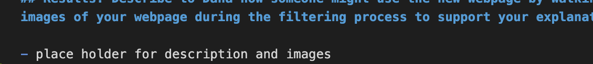

# UFOs

## Overview of Project: Explain the purpose of this analysis

- placeholder for overview/purpose of webpage and underlying database/filter tool

## Results: Describe to Dana how someone might use the new webpage by walking her through the process of using the search criteria. Use images of your webpage during the filtering process to support your explanation

- place holder for description and images
- 

## Summary: In a summary statement, describe one drawback of this new design and two recommendations for further development

- address major drawback of blind input fields

- add two recommendations for further development
  - sort table
  - dropdown input fields to validate selections/ensure user isn't blindly entering random values
