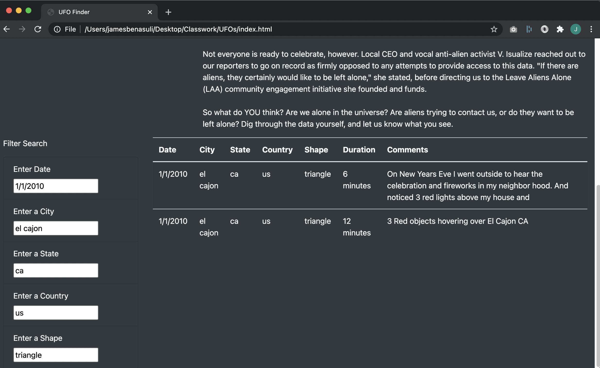
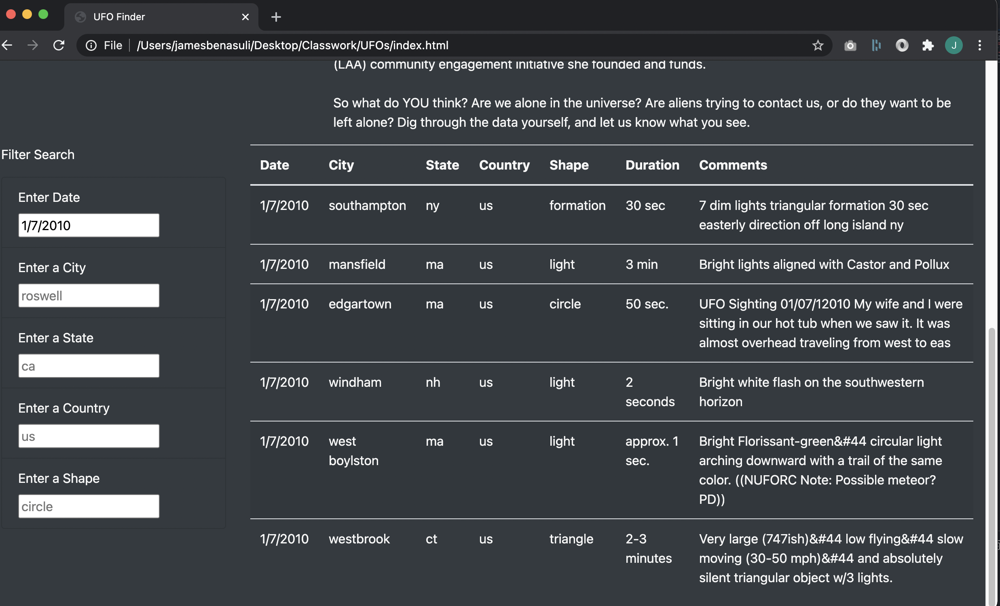

# UFOs

## Overview of Project

The purpose of this project is provide users the ability to search for and analize the data of UFO sightings.

The array of UFO sightings data has been tabulated and added to an HTML webpage allowing users to easily view information regarding each UFO sighting. The table is dynamically constructed with filters for five of the fields giving users the ability to easily drill down their search on up to five criteria.

## Results

Upon loading the webpage, users will see all the UFO sightings data in the table. To refine the results displayed in the table, users can input values for one or more of the filter fields located to the left of the table. Below are screenshots of the webpage with examples of no filter, one filter and all five filters being used in a search.

It is important to note that a field containing light gray text does not indicate a search entry. The light gray values are placeholder values meant to serve as example inputs for users. Additionally, in order for a search input to take affect, users need to press the enter key or click outside the input box.

- No filters: all data is displayed in the table.

- Filtered by date: only UFO sightings on 1/7/2010 are displayed in the table. Note how the text in the date field is black compared to light gray in all the other fiels.

- Filtered by all five criteria: only UFOs sighted on 1/1/2010 in el cajon, ca, us with a triangle shape are displayed in the table.

## Summary: In a summary statement, describe one drawback of this new design and two recommendations for further development

- address major drawback of blind input fields

- add two recommendations for further development
  - sort table
  - dropdown input fields to validate selections/ensure user isn't blindly entering random values
